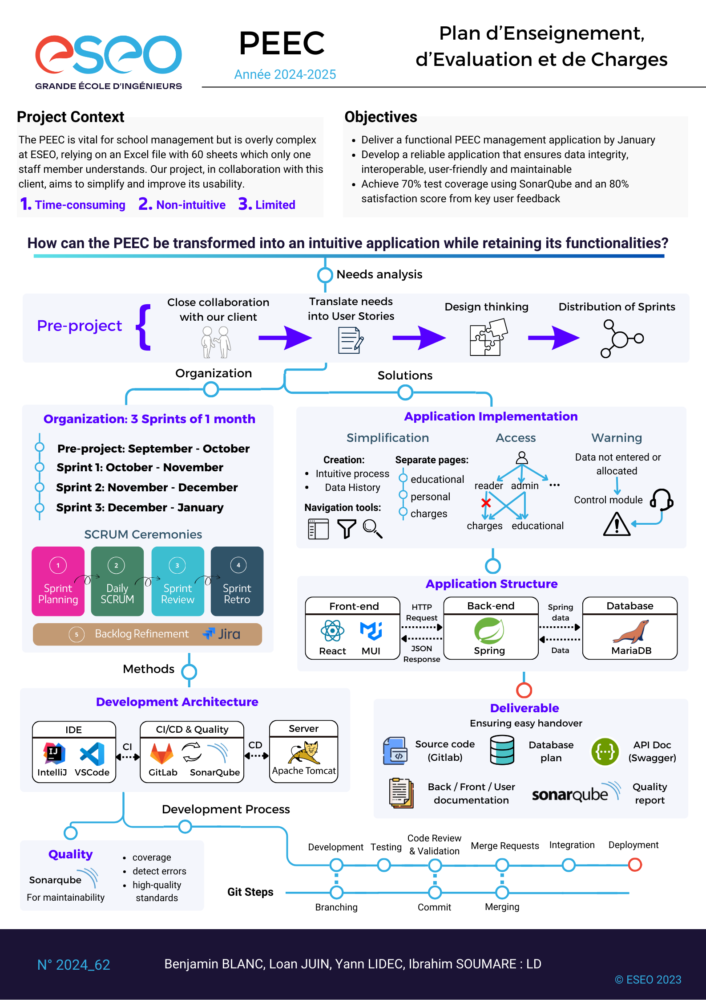

# Projet de fin d'étude - PEEC

**Titre : projet-fin-etude**

## 📌 Contexte

Le **PEEC** (Plan d’Enseignement, d’Évaluation et de Charges) est un outil indispensable à la gestion de l’ESEO.  
Actuellement basé sur un fichier **Excel complexe de 60 feuilles**, il est difficile à utiliser, chronophage et difficilement reprenable.

Notre équipe de **4 développeurs** a travaillé en collaboration avec une administratrice de l’ESEO afin de concevoir une application moderne et intuitive qui reprend les fonctionnalités existantes tout en simplifiant leur usage.

## ❓ Problématique

Comment transformer le **PEEC** en une application **intuitive, fiable et maintenable**, tout en conservant ses fonctionnalités essentielles ?

## 🎯 Objectifs

- Simplifier l’utilisation du PEEC via une application claire et intuitive
- Garantir la fiabilité et la maintenabilité de la solution
- Atteindre **70% de couverture de test** (SonarQube) sur les fonctions pertinentes
- Obtenir **80% de satisfaction utilisateur** via un questionnaire

## 🛠️ Technologies

- **Front-end :** React, Material UI
- **Back-end :** Spring Boot
- **Base de données :** MariaDB
- **Outils qualité :** SonarQube, GitLab CI/CD
- **Méthodologie :** Agile SCRUM (3 sprints d’1 mois)

## 📂 Livrables

- Code source (confidentiel)
- Base de données (schéma et scripts)
- Documentation (utilisateur, technique, API Swagger)
- Rapport qualité (tests, couverture SonarQube)

## 📜 Poster du projet

---

👥 Équipe : Benjamin BLANC, Loan JUIN, Yann LIDEC, Ibrahim SOUMARE
